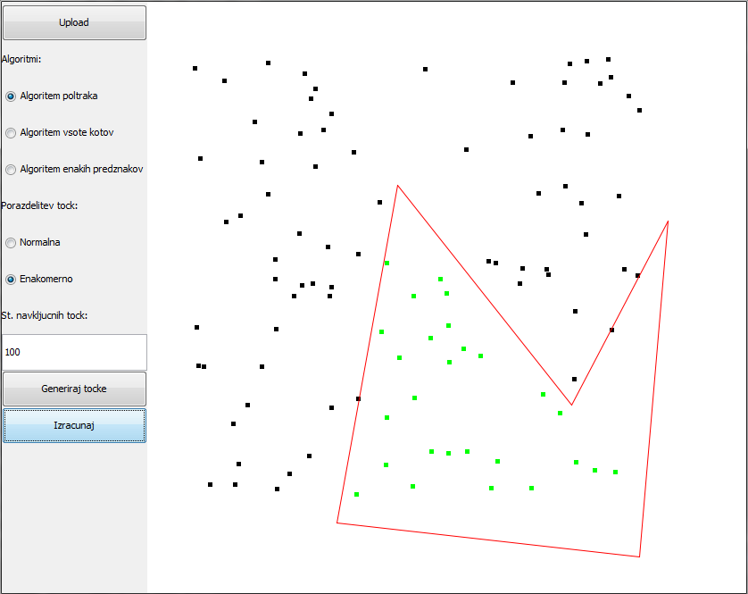

# Point inside polygon
_“In computational geometry, the point-in-polygon (PIP) problem asks whether a given point in the plane lies inside, outside, or on the boundary of a polygon.”_ Wikipedia.

In this app we will try to do exactly that, test if the given points are inside of the polygon. To do that we use these algorithms:
* Ray crossing algorithm
* Sum of angles
* Orientation method

The app also allows the user to:
* Upload a file with x and y-coordinates of polygon vertices
* Choose algorithm for testing
* Choose disposition and number of testing points

## App demo

